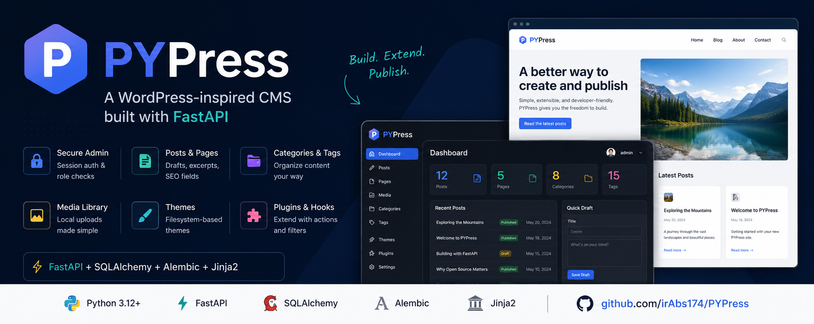

# PYpress



PYpress is a Python-based CMS inspired by WordPress and built on FastAPI.

## Features

- Session-based admin authentication with role checks
- Public registration (subscriber role) and admin user management
- Protected admin dashboard
- Posts and pages with draft/published/scheduled states, excerpts, and SEO fields
- Rich text editor with media library insert
- Categories and tags
- Media library (local uploads)
- Public site rendering via filesystem themes
- Plugin system with action/filter hooks
- REST API for posts and pages (`/api/v1/...`)
- SQLAlchemy models and Alembic migrations
- Server-rendered UI using Jinja2 templates

## Requirements

- Python 3.12+

## Quick Start

```bash
python -m venv .venv
source .venv/bin/activate
pip install -e ".[dev]"
cp .env.example .env
uvicorn app.main:app --reload
```

The public site starts on `http://127.0.0.1:8000`.
Admin is at `http://127.0.0.1:8000/admin`.

Default bootstrap admin credentials:

- Email: `admin@example.com`
- Password: `admin12345`

Change them in `.env` before running outside local development.

If you already have an older local `pypress.db`, delete it (or run Alembic migrations) so the new schema is created.

## Environment

Create a `.env` file from `.env.example` and update any values as needed.

## Themes and plugins

- Themes live in `themes/<name>/` with `theme.json` and `templates/`
- Plugins live in `plugins/<name>/` with `plugin.json` and `plugin.py` exposing `register(app, hooks)`
- From **Admin → Plugins** you can:
  - Create a new plugin (editor for `plugin.py`)
  - Edit existing plugin source and metadata
  - Upload a `.zip` containing `plugin.json` + `plugin.py`
  - Enable, disable, or delete plugins (hooks reload immediately)
- Uploads are stored in `uploads/` and served at `/uploads/...`
- Manage themes from the admin UI

Core hooks:

- `app.startup`
- `content.before_save` / `content.after_save`
- `public.before_render` (filter) — mutate public template context
- `public.access` (filter) — return a Response to gate public pages
- `admin.nav_items` (filter) — append `{href, label, icon}` entries to the admin sidebar

Example plugins (disabled by default — enable in **Admin → Plugins**):

| Plugin | What it shows |
|--------|----------------|
| `theme_customizer` | **Appearance** settings: colors, presets, hero copy, fonts, custom CSS |
| `maintenance_mode` | Public maintenance screen with staff bypass |
| `reading_time` | “N min read” on single posts |
| `cookie_consent` | Dismissible cookie banner + admin copy settings |
| `hello_world` | Footer note (enabled by default) |

Plugins may register FastAPI routes with `app.include_router(...)`, ship Jinja templates under `plugins/<name>/templates/`, and persist options via `SiteSetting` keys.

## REST API

Session-authenticated JSON API under `/api/v1`:

- `GET /api/v1/posts` / `GET /api/v1/pages` — public list (published + due scheduled)
- `GET /api/v1/posts/{slug}` / `GET /api/v1/pages/{slug}` — public item
- `POST|PATCH|DELETE /api/v1/posts` / `pages` — staff write access
- `GET /api/v1/me` — current user

Interactive docs: `/docs`

## Docker

Run PYpress with Docker Compose (app + PostgreSQL):

```bash
cp .env.example .env
docker compose up --build
```

The application starts on `http://127.0.0.1:8000`.

Useful commands:

```bash
docker compose up --build -d
docker compose logs -f web
docker compose down
```

Docker Compose overrides `DATABASE_URL` to use PostgreSQL. Change `SECRET_KEY` and `ADMIN_PASSWORD` in `.env` before deploying.

## Tests

```bash
pytest
```

## Project Layout

```text
app/
  admin/
  auth/
  cms/
  core/
  database/
  media/
  plugins/
  themes/
  static/
  templates/
themes/
plugins/
uploads/
migrations/
scripts/
tests/
```
